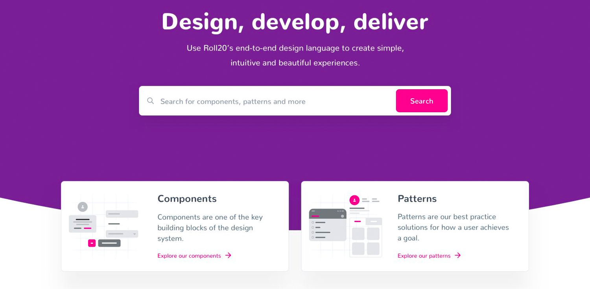

# Roll20 Design System
[Visit website](http://design.roll20.net)

# Stack

- [Hugo](http://gohugo.io) - static site generator, found in this repo
- [Firebase Hosting]() - static site hosting; config found in `.firebaserc` file
- [Github Actions]() - git based deploy, config found in `.github/` folder
- [Forestry.io](http://forestry.io) - CMS as a service, let's non-devs edit Hugo content

__NOTE!! Any update pushed to master will be deployed to live!__

## Deploying to Firebase Manually

These directions are how to manually deploy, should you need to.

### Prerequisites

__Things you’ll need access to__

- The Git repository (style-guide)
- Access to the Firebase project

__Things you’ll need to have installed__

- The Hugo CLI
- The Firebase CLI

#### Installing the Hugo CLI

Follow the directions from the Hugo Docs to install the CLI for your OS. 

#### Installing and Configuring the Firebase CLI

Follow these directions to install the Firebase CLI

Once installed run firebase login from your terminal. This will open a browser window where you can login using your Roll20 email.

### The deploy process 

Build the site pages and assets by running `hugo -d` from within the project folder in your terminal

Run `firebase deploy` to push the content live based on the project named found in the `.firebaserc` file located in the root folder. This will make your changes to the site live immediately.

Make sure you have committed any changes to the repo, and push them to the master branch. 

### Behind the scenes

For configuration of similar projects in the future, here's some of the cogs in the machine, as it were:

 - There is a github actions workflow (see `.github`) which deploys the site to firebase.  Everything will work as-is for an empty firebase project; in this case, it's `roll20-actual` as specified in `.firebaserc`.
 - This action uses a secret generated from a service account with the "Firebase Admin" permission on the project.  (alternatively, one could use an authenticated user's key from `firebase login:ci`, but this will be ephemeral and tied to that user account; don't use for production sites.  See [Github Actions for Firebase](https://github.com/marketplace/actions/github-action-for-firebase) for more info.
 - Forestry.io is configured to listen on a webhook emitted by this repository (see this repository's Settings for the webhook configuration).  Forestry configuration is authenticated to this private repository with the "Manual Setup" option in Forestry, which provides a public SSH key to add (see "Deploy Keys" in this repository's settings)
 
With all of those configured, changes to the repository are updated to firebase continuously, and forestry can access and perform those updates at will.
